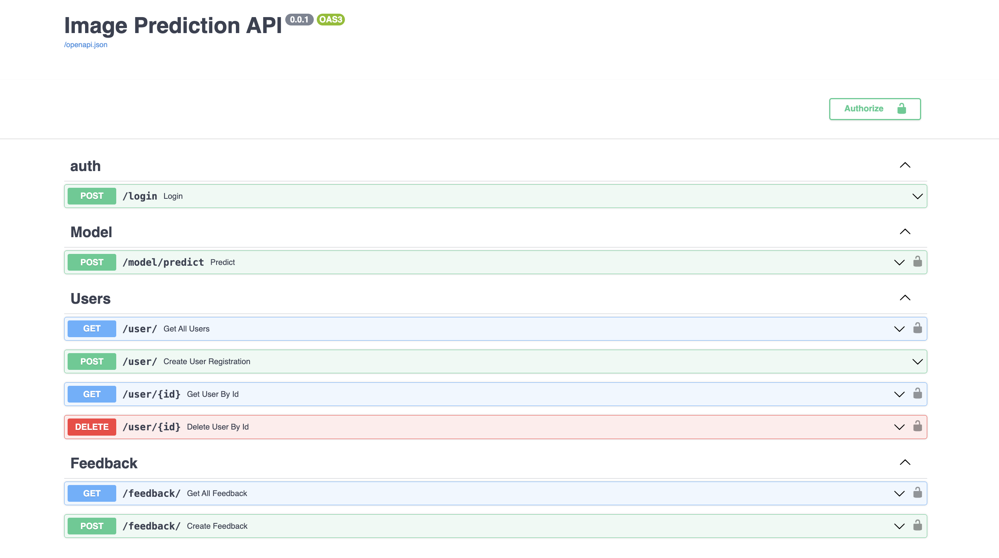
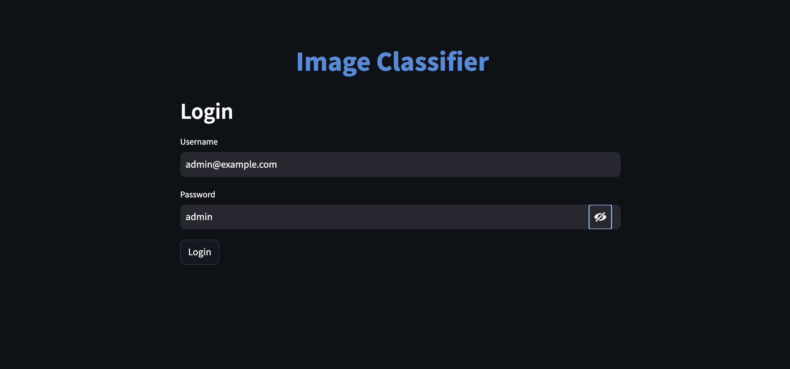
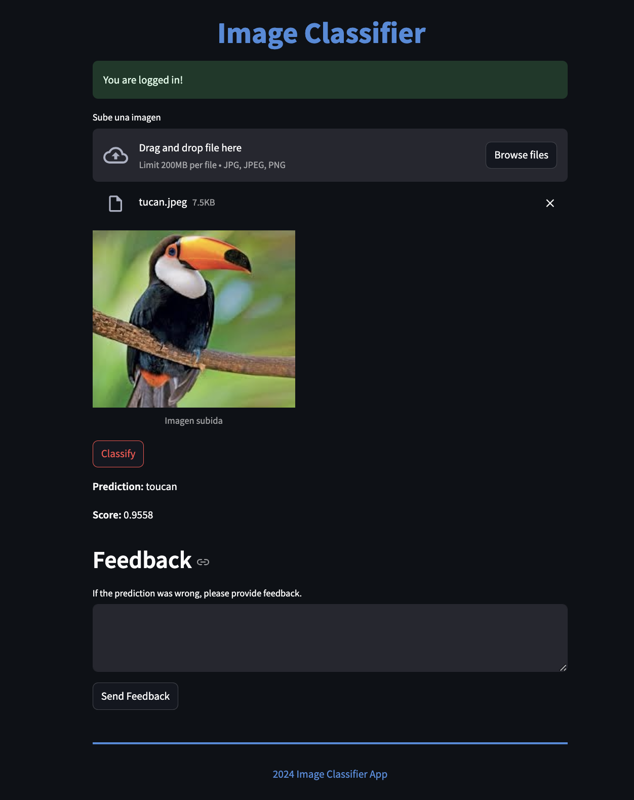

# Distributed Image Classifier Infrastructure

This platform is a production-ready, highly modular system designed for high-performance, asynchronous image classification. The architecture leverages containerized microservices to decouple client requests, task queue routing, relational storage, and neural network inference.

---

## Key Features

- **Decoupled Architecture**: Segregates frontend interaction, API gateway validation, message brokers, and heavy computing inference.
- **High-Performance Deep Learning**: Integrated with a pre-trained **ResNet50** Convolutional Neural Network (CNN) powered by TensorFlow to classify images into over 1,000 labels.
- **Asynchronous Task Queue**: Employs **Redis** as a fast task queuing system to prevent high-latency ML execution from blocking HTTP connections.
- **Relational Data Management**: Stores secure user credentials and historical predictions feedback inside a structured **PostgreSQL** database.
- **Secure Authentication**: All communication to the REST endpoints is guarded with **JWT-based** authentication flows.
- **Streamlined Frontend Dashboard**: A rich Web UI crafted in **Streamlit** that enables secure user login, fast image uploads, classification display, and feedback collection.
- **Automated Stress Testing**: Uses **Locust** to evaluate the platform's response, capacity, and latency under heavy concurrency workloads.

---

## Architectural Layout

The infrastructure is split into five active components managed through a shared docker environment:

1. **API Gateway (FastAPI)**: Serves as the primary public entry point. It hosts the REST endpoints, validates JWT credentials, manages database operations via SQLAlchemy, and pushes tasks into the queue.
2. **Model Processing Agent (TensorFlow)**: A dedicated service that monitors the Redis task queue, loads images from shared volumes, performs inference using ResNet50, and publishes the predictions.
3. **Broker Service (Redis)**: Acts as the real-time transmission layer between the FastAPI gateway and the Tensorflow worker.
4. **Data Repository (PostgreSQL)**: Stores system records, credentials, and classification feedback.
5. **Web Client (Streamlit)**: Provides a simple interface allowing users to upload images, view classification results, and send back review data.

---

## Local Setup & Deployment

### Core Requirements
Before starting, ensure the host machine has the following tools installed:
- **Docker Engine**
- **Docker Compose**
- **Python 3** (Optional, to execute localized tests and formattings)

### 1. Environment Configurations
Instantiate your project configuration file from the default template:
```bash
cp .env.original .env
```

### 2. Network Creation
Set up the custom shared network that binds all microservices together:
```bash
docker network create shared_network
```

> [!NOTE]
> **Apple Silicon Macs (M1/M2/M3 Chips):**
> A custom docker file tailored for ARM64 compilation is available at `model/Dockerfile.M1`. If deploying on Apple Silicon, configure the `docker-compose.yml` to build from `Dockerfile.M1` and exclude the local `tensorflow` reference from the model dependencies directory to bypass architecture conflicts.

### 3. Database Initialization & Population
To provision and populate the initial dataset into the PostgreSQL instance, run:
```bash
cd api
cp .env.original .env
docker compose up --build -d
```

### 4. Running the Complete Infrastructure
To compile and launch all active services in detached mode, run:
```bash
docker compose up --build -d
```

To stop and tear down the running stack:
```bash
docker compose down
```

---

## Endpoint References & Interface Previews

### 1. API Documentation Interface
- **FastAPI Documentation & Swagger UI**: [http://localhost:8000/docs](http://localhost:8000/docs)
  - *Standard Test Credentials*:
    - **User**: `admin@example.com`
    - **Password**: `admin`



### 2. Streamlit Web Dashboard
- **Streamlit Web Application**: [http://localhost:9090](http://localhost:9090)

#### Secure Authentication Portal
The web client features a secure authentication prompt where users log in with the platform's default admin credentials.



#### Core Classification Interface
Upon login, the dashboard enables users to upload images, get instant model predictions, and submit classification review feedback.



---

## Code Quality and Style Standards

The codebase enforces robust coding aesthetics through automated formatters. You can format code and align imports across the repository using `black` and `isort`:

```bash
isort --profile=black . && black --line-length 88 .
```

---

## Validation & Automated Testing

The system provides separate pipelines for testing individual microservices inside isolated environments, and end-to-end integration tests on the host.

### 1. Microservice Unit & Component Tests

#### FastAPI Gateway Endpoint Tests
```bash
cd api/
docker build -t fastapi_test --progress=plain --target test .
```

#### TensorFlow Service Core Tests
```bash
cd model/
docker build -t model_test --progress=plain --target test .
```

#### Streamlit Frontend Interface Tests
```bash
cd ui/
docker build -t ui_test --progress=plain --target test .
```

### 2. Full Integration End-to-End Tests
Ensure the docker infrastructure is fully up and running. In your host environment, install the integration test prerequisites and run the test harness:

```bash
pip install -r tests/requirements.txt
python tests/test_integration.py
```
